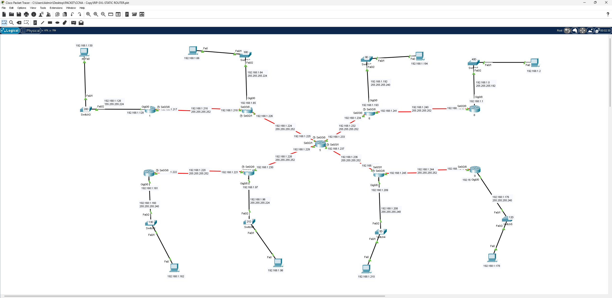

# RIP + SVI + Static Routing – شبكة موزعة بتوجيه مختلط

## 📖 الوصف
مشروع شامل يجمع بين عدة تقنيات توجيه على شبكة كبيرة تضم **9 راوترات**، مصمّمة بشكل نجمي (Star/Hub) حول راوتر مركزي، مع استخدام **VLSM** لتقسيم عنونة الشبكة.

## 🗺️ التصميم (Topology)

- راوتر مركزي (**Router 5**) يربط 8 راوترات فرعية (1, 6, 8, 9, ومسميات أخرى) عبر روابط Serial بأقنعة متفاوتة (`/27`, `/28`, `/29`)
- كل راوتر فرعي يخدم شبكة LAN عبر سويتش وأجهزة PC، بعناوين من نطاق `192.168.1.0/24` مقسّمة بـ VLSM

## ⚙️ المفاهيم المطبقة
- تصميم شبكة موزعة (Hub-and-Spoke) حول راوتر مركزي
- استخدام **VLSM** لتوزيع عناوين IP بكفاءة على شبكات مختلفة الأحجام
- إعداد **SVI** (Switch Virtual Interface) على السويتشات للإدارة عن بعد
- التوجيه الساكن (Static Routing) و/أو بروتوكول **RIP** لربط جميع الشبكات

## 🎯 الهدف من المشروع
بناء شبكة واقعية كبيرة الحجم بعدة فروع، وتطبيق دمج بين التوجيه الساكن والديناميكي (RIP) مع إدارة السويتشات عبر SVI — سيناريو قريب من شبكات المؤسسات متعددة الفروع.

## 📂 الملف
- [`RIP-SVI-Static-Router.pkt`](./RIP-SVI-Static-Router.pkt) — ملف Packet Tracer الكامل
